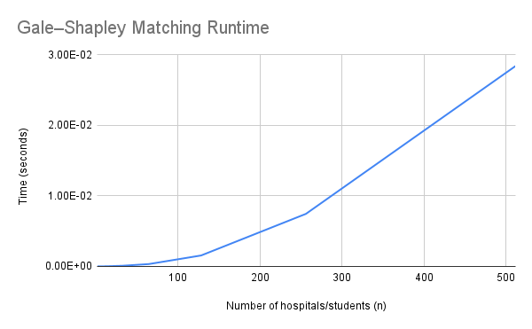
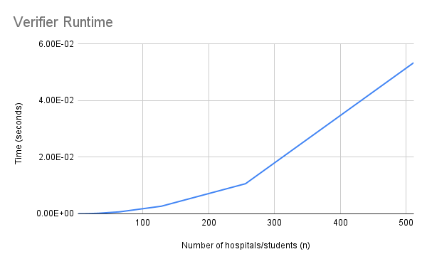

HOW TO RUN
----------
1. Run the matching algorithm:
   python3 main.py

2. Verify a matching:
   python3 verifier.py example.in example.out

3. Run scalability benchmarks:
   python3 benchmark.py

PROJECT: Stable Matching (Hospital–Student)
-------------------------------------------

This project implements the hospital-proposing Gale–Shapley algorithm for
stable matching, along with a verifier to check validity and stability, and
a benchmarking script to measure runtime scalability.

FILES
-----
main.py
  Implements the Gale–Shapley matching algorithm. Reads example.in and
  writes the matching to example.out.

verifier.py
  Verifies that a matching is valid and stable given a preference file.

benchmark.py
  Generates random inputs and measures runtime of the matcher and verifier
  for increasing values of n.

example.in
  Sample input file containing hospital and student preferences.

SCALABILITY
-----------
Both the matching algorithm and the verifier exhibit approximately O(n^2)
runtime behavior, which matches the theoretical analysis. As n doubles, the
runtime increases by roughly a factor of four as seen in the Graphs below.

AUTHORS
-------
Christopher Bowers (19272960)
Aidan Ragan (8136827552)

